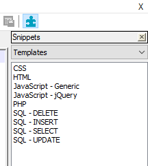
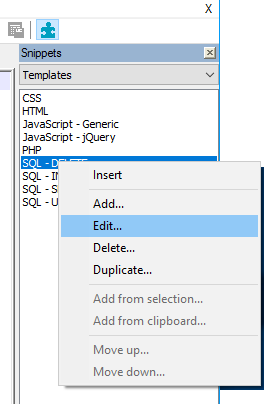
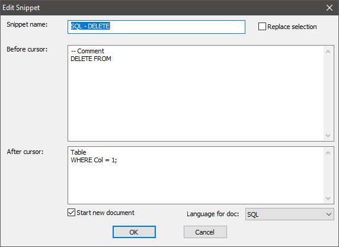
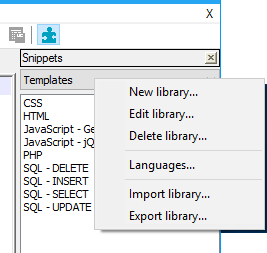

.. _usage:

How to use
==========

To open the Snippets window, click on the ``jigsaw`` button on the
toolbar, or via the menu ``Plugins``, ``Snippets``, ``Snippets``.

The window consists of two parts. A combobox where you can select the
library and underneath it is the list of snippets in the chosen library.
In the sample above the library is named ``Templates``.

To insert a snippet simply double-click on the item in the list and the
snippet is inserted at the current cursor position.

When you switch to a document with another language the snippets for
that new language are read from the database.

Edit a snippet
--------------

To edit a snippet, right-click the item and choose ``Edit...``.

A dialog will appear where you can edit the selected snippet.

Edit a library
--------------

To edit a library, right-click the name of the library.
A context menu will appear and choose ``Edit library...``.

